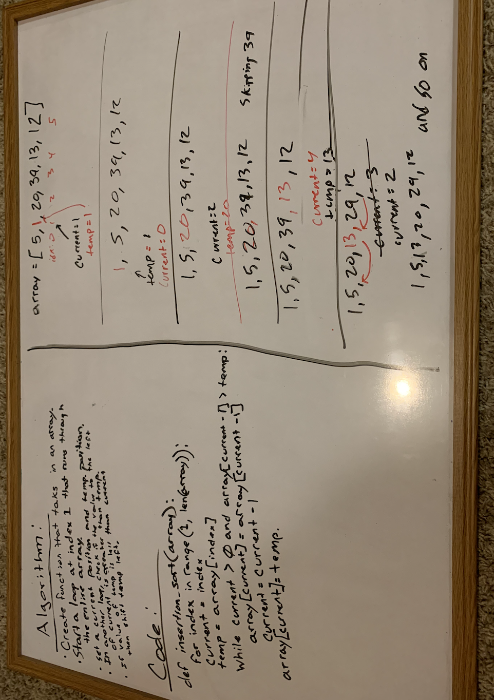

# Selection Sort Method

## Whiteboard

## Code

def selection_sort(array):
    x = len(array)

    for i in range(x):

        lowest_value = i

        for j in range(i + 1, x):
            if array[j] < array[lowest_value]:
                lowest_value = j

        array[lowest_value], array[i] = array[i], array[lowest_value]

## Tests

expected = [4,8,15,16,23,42]
array = [8,4,23,42,16,15]
selection_sort(array)

assert array == expected

## Walkthrough

##### You would start at 8 and by definition that is the lowest number.
##### Then you would compare 4 with 8.
##### 4 is smaller than 8 so 4 gets placed under the lowest_value variable.
##### Then you compare 23 and 8 and so on until you compare the 15 and 8.
##### With 4 still the lowest number at the end of one pass through, the lowest_value and the value at i swap.
##### The new array is now [4, 8, 23, 42, 16, 15]
##### The second pass though starts by comparing the 8 to everything else in the array, since 8 is lower than everything after it, 8 stays in its place and the second pass through is over.
##### The array is still [4, 8, 23, 42, 16, 15]
##### The third pass through the pointer starts at 23, and compare wiht the 42. lowest_value = 23
##### Then you compare the 23 with the 16. lowest_value = 16
##### Then you compare the 23 with the 15. lowest_value = 15
##### Since i was in the position of 42, 42 and 15 will swap locations.
##### The new array is now [4, 8, 15, 42, 16, 23]
##### Now you compare the the 15 with the 42. lowest_value = 15
##### Then 15 and 16. Then 15 and 23. Since 15 is the lowest it stays put.
##### The array is still [4, 8, 15, 42, 16, 23]
##### Pointer then starts at 42 and compars to 16. lowest_value = 16
##### Compars the 42 with the 23. With the lowest value being 16 at the end, 42 and 16 will swap locations.
##### Your new array is [4, 8, 15, 16, 42, 23]
##### Your pointer now stands on 42 and compars itself to the 23. Since 23 is lowest_value.
##### New array = [4, 8, 15, 16, 23, 42]
##### Your array is now sorted and is done running.

# Merge Sort

## Whiteboard

## Code

def merge_sort(array):
        merge_sort2(array, 0, len(array)-1)

def merge_sort2(array, first, last):
        if first < last:

## Tests

expected = [4,8,15,16,23,42]
array = [8,4,23,42,16,15]
merge_sort(array)

assert array == expected

## Walkthrough

##### You are going to be starting out with one list and pass that list into the merge_sort function.
#####You are going to go ahead and say that if the length of the list is less than or equil to one then return the list.
##### else you are going to set the variable lft and right equil to the split of the list.
##### Create a seperate split function that takes in a list and finds the length, center, and then splits the list into 2 lists (L and R).
##### After it is split and you return 2 lists, you need to pass those into a merge sorted list function.
##### That function is going to look at list L and if it equils 0 then it will return R and vice versa.
##### Set the index of both L and R to zero
##### set a new variable for the completed merged list to go to an empty list.
##### Go ahead and set the definate length of the new list by setting a target lenght to L + R
##### While the lenght of the empty list is less than the target length you are going to want to do a few things.
##### * if L is less than or equil to R you want to append the value of L as well as increase the L index by one.
##### else append the R.
##### If the R index is equal to the length of R you are goiing to break. Do the same with L.
##### return the final list.