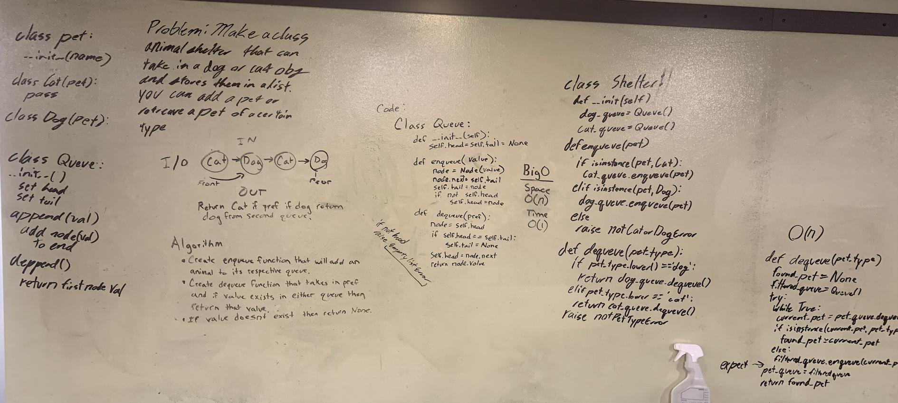

# Animal Shelter
Create a class called animal shelter that keeps a queue of cats and dogs. It has 2 methods

## Challenge
Enqueue: Take in a `Cat` or `Dog` object as an input and have it added on to it's respective queue. If not a `Cat` or `Dog` raise an error.

Dequeue: Take in a string of `'cat'` or `'dog'` as the input and return the first of that animal from their respective list. If the input doesn't match one of the given strings return `None`.

## BigO
O(1) for time and space

## Solution
